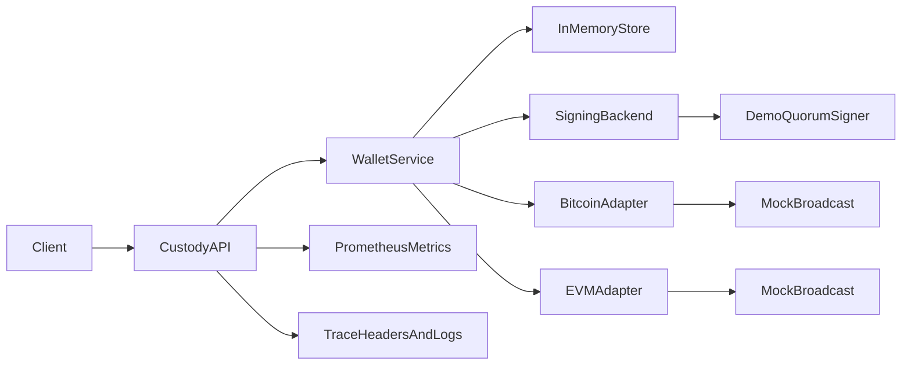

# MPC Custody Wallet

Minimal Go backend for a multi-chain custody wallet service. It demonstrates how a custody API can abstract over Bitcoin's UTXO model and an EVM account model while enforcing a 2-of-3 approval workflow before signing and broadcast.

This repository is intentionally honest about crypto scope: the first implementation uses a local demo signer gated by a 2-of-3 quorum policy. The signing boundary is designed so a production MPC backend, such as a GG20 or CGGMP21 threshold ECDSA service, can replace the demo signer without rewriting API or chain orchestration code.

## Architecture



## What It Supports

- `POST /v1/wallets` creates a Bitcoin or EVM wallet.
- `POST /v1/transactions` creates a transaction proposal.
- `POST /v1/transactions/{id}/cosign` records a signer approval and signs after two unique approvals.
- `POST /v1/transactions/{id}/broadcast` broadcasts the signed payload through the chain adapter.
- `GET /v1/transactions/{id}` returns transaction state.
- `GET /healthz`, `GET /readyz`, and `GET /metrics` expose operational endpoints.

## Quickstart

```sh
docker compose -f deploy/docker-compose.yml up --build
```

Create an EVM wallet:

```sh
curl -s localhost:8080/v1/wallets \
  -H 'content-type: application/json' \
  -d '{"chain":"evm"}'
```

Propose a transaction:

```sh
curl -s localhost:8080/v1/transactions \
  -H 'content-type: application/json' \
  -d '{
    "wallet_id": "wlt_replace_me",
    "to": "0x1111111111111111111111111111111111111111",
    "amount": "1000000000000000",
    "gas_limit": 21000,
    "max_fee_per_gas": "2000000000"
  }'
```

Co-sign twice:

```sh
curl -s localhost:8080/v1/transactions/txn_replace_me/cosign \
  -H 'content-type: application/json' \
  -d '{"signer_id":"alice"}'

curl -s localhost:8080/v1/transactions/txn_replace_me/cosign \
  -H 'content-type: application/json' \
  -d '{"signer_id":"bob"}'
```

Broadcast:

```sh
curl -s -X POST localhost:8080/v1/transactions/txn_replace_me/broadcast
```

Prometheus metrics are available at `http://localhost:8080/metrics`, and the Compose stack exposes Prometheus at `http://localhost:9090`.

## Bitcoin Proposal Shape

Bitcoin proposals require caller-selected UTXOs so the service can show the UTXO orchestration path explicitly:

```json
{
  "wallet_id": "wlt_replace_me",
  "to": "tb1qrecipient",
  "amount": "50000",
  "fee_rate_sats": 5,
  "utxos": [
    {
      "tx_id": "previous_tx_id",
      "vout": 0,
      "amount_sats": 75000,
      "script_pub_key": "0014..."
    }
  ]
}
```

## Trade-Offs

- The demo signer uses a local development key after quorum is reached. It is not MPC and should not secure funds.
- Broadcast is deterministic and mocked so the repository runs without node credentials.
- Persistence is in-memory in the first version. The service boundary is ready for Postgres or another durable store.
- The EVM adapter models nonce and EIP-1559 fields; the Bitcoin adapter models UTXO selection and fee-rate requirements.

## Deploy

Build locally with Docker:

```sh
docker build -t mpc-custody:local .
```

Apply the Kubernetes demo manifests:

```sh
kubectl apply -f deploy/k8s
```

Set `image` in `deploy/k8s/deployment.yaml` to the registry tag you publish.
