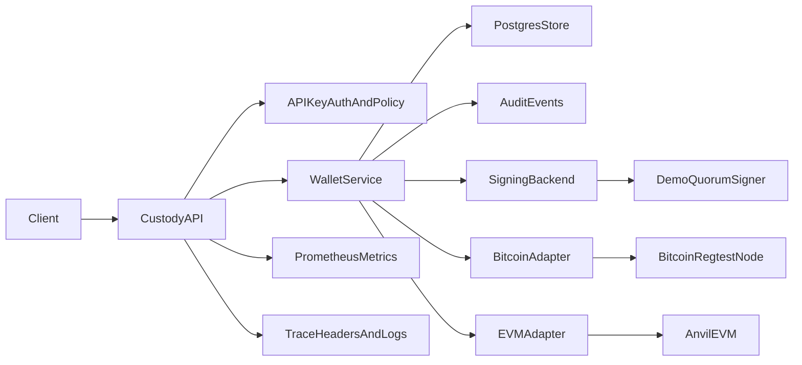

# MPC Custody Wallet

Minimal Go backend for a multi-chain custody wallet service. It demonstrates how a custody API can abstract over Bitcoin's UTXO model and an EVM account model while enforcing a 2-of-3 approval workflow before signing and broadcast.

This repository is intentionally honest about crypto scope: the first implementation uses a local demo signer gated by a 2-of-3 quorum policy. The signing boundary is designed so a production MPC backend, such as a GG20 or CGGMP21 threshold ECDSA service, can replace the demo signer without rewriting API or chain orchestration code.

## Architecture



## What This Proves

- Backend service design: clean domain/service/store boundaries, durable persistence, idempotency, audit logging, policy checks, health/readiness, CI, Docker, and Kubernetes manifests.
- Blockchain transaction modeling: Bitcoin UTXO proposals are explicit about inputs and fee rate, while EVM proposals use nonce/gas/account semantics and EIP-1559 raw transaction signing.
- Custody product thinking: signing is gated by a 2-of-3 approval policy, signer IDs are allowlisted, transaction amounts are capped, and security-relevant state transitions are queryable through an audit log.
- Production reliability: structured logs, trace headers, Prometheus metrics, Postgres migrations, Docker Compose, GitHub Actions, and a repeatable demo script are all included.

## What It Supports

- `POST /v1/wallets` creates a Bitcoin or EVM wallet.
- `POST /v1/transactions` creates a transaction proposal.
- `POST /v1/transactions/{id}/cosign` records a signer approval and signs after two unique approvals.
- `POST /v1/transactions/{id}/broadcast` broadcasts the signed payload through the chain adapter.
- `GET /v1/transactions/{id}` returns transaction state.
- `GET /v1/audit/events` returns immutable custody audit events.
- `GET /healthz`, `GET /readyz`, and `GET /metrics` expose operational endpoints.

## Quickstart

```sh
docker compose -f deploy/docker-compose.yml up --build
```

The Compose stack starts the API, Postgres, Anvil, Bitcoin Core in regtest mode, and Prometheus. The API runs migrations automatically when `DATABASE_URL` is set and uses Anvil for EVM nonce, gas, signing, and broadcast demos.

Run the full demo flow:

```sh
./scripts/demo.sh
```

The script starts Docker Compose, creates EVM and Bitcoin wallets, proposes transactions, records two co-signatures, broadcasts both transactions, checks Postgres persistence, checks the Bitcoin regtest node, verifies metrics/audit events, and stops the stack.

Compose enables API-key auth with `dev-api-key`:

```sh
export API_KEY=dev-api-key
```

Create an EVM wallet:

```sh
curl -s localhost:8080/v1/wallets \
  -H 'content-type: application/json' \
  -H "X-API-Key: $API_KEY" \
  -H 'Idempotency-Key: create-demo-evm-wallet' \
  -d '{"chain":"evm"}'
```

Propose a transaction:

```sh
curl -s localhost:8080/v1/transactions \
  -H 'content-type: application/json' \
  -H "X-API-Key: $API_KEY" \
  -H 'Idempotency-Key: propose-demo-evm-transaction' \
  -d '{
    "wallet_id": "wlt_replace_me",
    "to": "0x1111111111111111111111111111111111111111",
    "amount": "1000000000000000",
    "gas_limit": 21000,
    "max_fee_per_gas": "2000000000"
  }'
```

Co-sign twice:

```sh
curl -s localhost:8080/v1/transactions/txn_replace_me/cosign \
  -H 'content-type: application/json' \
  -H "X-API-Key: $API_KEY" \
  -d '{"signer_id":"alice"}'

curl -s localhost:8080/v1/transactions/txn_replace_me/cosign \
  -H 'content-type: application/json' \
  -H "X-API-Key: $API_KEY" \
  -d '{"signer_id":"bob"}'
```

Broadcast:

```sh
curl -s -X POST localhost:8080/v1/transactions/txn_replace_me/broadcast \
  -H "X-API-Key: $API_KEY"
```

Query audit events:

```sh
curl -s localhost:8080/v1/audit/events \
  -H "X-API-Key: $API_KEY"
```

Prometheus metrics are available at `http://localhost:8080/metrics`, and the Compose stack exposes Prometheus at `http://localhost:9090`.

## Bitcoin Proposal Shape

Bitcoin proposals require caller-selected UTXOs so the service can show the UTXO orchestration path explicitly:

```json
{
  "wallet_id": "wlt_replace_me",
  "to": "tb1qrecipient",
  "amount": "50000",
  "fee_rate_sats": 5,
  "utxos": [
    {
      "tx_id": "previous_tx_id",
      "vout": 0,
      "amount_sats": 75000,
      "script_pub_key": "0014..."
    }
  ]
}
```

## Trade-Offs

- The demo signer uses a local development key after quorum is reached. It is not MPC and should not secure funds.
- Bitcoin broadcast is deterministic and mocked while the Compose stack includes Bitcoin Core regtest for the next raw-transaction milestone. EVM broadcast uses Anvil in Docker Compose when `EVM_RPC_URL` is set.
- Docker Compose uses Postgres-backed persistence. Running the binary without `DATABASE_URL` falls back to in-memory storage for quick demos and tests.
- API-key auth, signer allowlisting, amount limits, idempotency keys, and audit events are implemented for custody-control realism.
- The EVM adapter models nonce and EIP-1559 fields; the Bitcoin adapter models UTXO selection and fee-rate requirements.

## Deploy

Build locally with Docker:

```sh
docker build -t mpc-custody:local .
```

Apply the Kubernetes demo manifests:

```sh
kubectl apply -f deploy/k8s
```

Set `image` in `deploy/k8s/deployment.yaml` to the registry tag you publish.

For Kubernetes, provide a `custody-api-database` Secret with a `database-url` key to enable durable persistence. Provide a `custody-api-evm` Secret with `rpc-url` and `dev-private-key` keys to enable EVM RPC broadcast in a demo cluster. Without those Secrets, the service starts with its local fallbacks.
