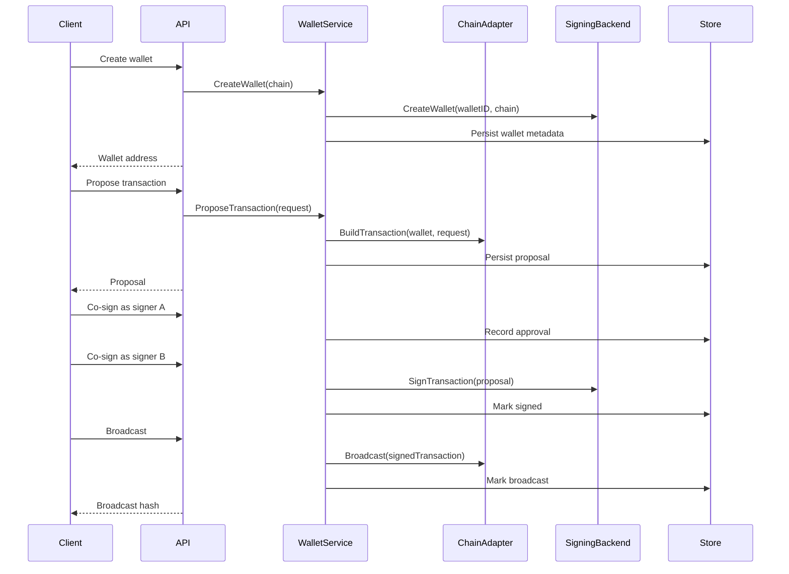

# Design: Minimal MPC Custody Wallet

## Goals

This service is a compact portfolio project for custody backend design. It focuses on the backend boundaries that matter in production wallet systems:

- Multi-chain transaction orchestration.
- Quorum-gated signing.
- A signing interface that can be backed by real threshold ECDSA later.
- Operational visibility through metrics, trace IDs, health checks, and structured logs.
- Container and Kubernetes deployment artifacts.

## Non-Goals

The first version does not implement MPC cryptography. Implementing GG20 or CGGMP21 correctly requires careful protocol selection, peer transport, keygen ceremonies, transcript storage, recovery flows, and extensive review. A realistic first milestone is to build the orchestration layer and keep the signing backend replaceable.

The demo signer uses a local ECDSA key and only signs after two unique signer approvals. It is useful for API and workflow demonstrations, not for holding funds.

## Core Flow

## UTXO Versus Account-Based Chains

Bitcoin-style UTXO chains require explicit inputs. The service expects selected UTXOs in the proposal and validates that a fee rate is present. A production version would add coin selection, dust handling, change output construction, script policy checks, and RPC-backed UTXO discovery.

EVM chains are account-based. The adapter tracks nonces per wallet address and requires gas limit plus max fee per gas. A production version would replace local nonce tracking with RPC reads, pending nonce reconciliation, gas estimation, replacement transaction handling, and chain ID specific signing.

## Signing Boundary

The `SigningBackend` interface owns wallet material creation and transaction signing:

- `CreateWallet(ctx, walletID, chain)` returns public wallet metadata.
- `SignTransaction(ctx, proposal)` returns a signed transaction envelope.

A real MPC backend can replace the demo signer by moving key generation and signing into a distributed service. The API does not need to know whether the backend is local, remote, HSM-backed, or threshold ECDSA. The current `cosign` endpoint can evolve into a protocol-round endpoint if the MPC provider requires multiple interactive rounds.

## Observability

The service emits Prometheus-style metrics:

- `custody_http_requests_total`.
- `custody_http_request_duration_seconds_count`.
- `custody_http_request_duration_seconds_sum`.
- `custody_wallets_created_total`.
- `custody_transactions_proposed_total`.
- `custody_transaction_approvals_total`.
- `custody_transactions_signed_total`.
- `custody_transactions_broadcast_total`.

Every request receives or propagates a W3C-style `traceparent` header. The trace and span IDs are included in structured request logs and stored on transaction proposals when available.

## Production Extensions

The next production-oriented steps are:

- Add Postgres persistence for wallets, transaction proposals, signer approvals, and idempotency keys.
- Replace mock broadcast with Bitcoin Core/regtest and EVM JSON-RPC clients.
- Integrate a reviewed threshold ECDSA implementation or an external MPC signer.
- Add authentication, signer authorization, policy limits, and audit log export.
- Add OpenTelemetry exporters when external dependencies are allowed.
- Add CI that runs `go test ./...`, container build, and Kubernetes manifest validation.
