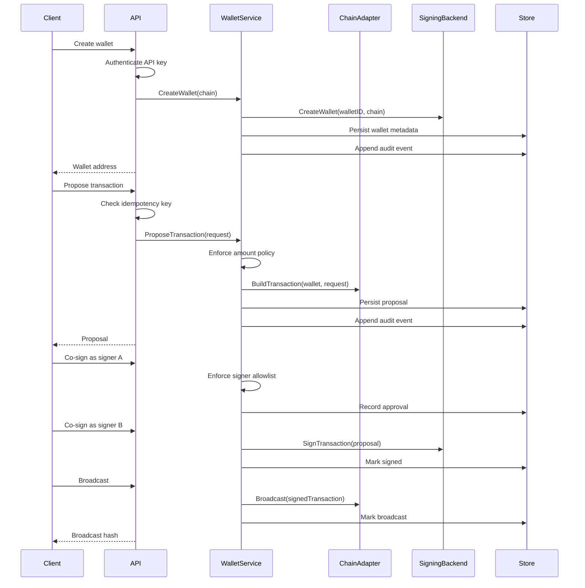

# Design: Minimal MPC Custody Wallet

## Goals

This service is a compact portfolio project for custody backend design. It focuses on the backend boundaries that matter in production wallet systems:

- Multi-chain transaction orchestration.
- Quorum-gated signing.
- A signing interface that can be backed by real threshold ECDSA later.
- Durable Postgres persistence for wallets, transaction proposals, idempotency keys, and audit events.
- Custody policy controls: API keys, signer allowlisting, amount limits, and idempotent writes.
- Operational visibility through metrics, trace IDs, health checks, and structured logs.
- Container and Kubernetes deployment artifacts.

## Non-Goals

The first version does not implement MPC cryptography. Implementing GG20 or CGGMP21 correctly requires careful protocol selection, peer transport, keygen ceremonies, transcript storage, recovery flows, and extensive review. A realistic first milestone is to build the orchestration layer and keep the signing backend replaceable.

The demo signer uses a local ECDSA key and only signs after two unique signer approvals. It is useful for API and workflow demonstrations, not for holding funds.

For EVM demos, the signer can use `EVM_DEV_PRIVATE_KEY`, which Docker Compose sets to Anvil's default funded account. That makes the local EVM flow broadcastable while keeping the key clearly scoped to development.

## Core Flow

## UTXO Versus Account-Based Chains

Bitcoin-style UTXO chains require explicit inputs. The service expects selected UTXOs in the proposal and validates that a fee rate is present. A production version would add coin selection, dust handling, change output construction, script policy checks, and RPC-backed UTXO discovery.

Docker Compose includes Bitcoin Core in regtest mode so local development has a real Bitcoin node available for RPC experiments. The current API still uses explicit caller-provided UTXOs and mock Bitcoin broadcast; the next Bitcoin-specific milestone is replacing that mock with a raw regtest transaction builder.

EVM chains are account-based. When `EVM_RPC_URL` is configured, the adapter reads chain ID, pending nonce, gas limit, and gas price data from JSON-RPC, then broadcasts signed raw transactions with `eth_sendRawTransaction`. Without RPC, it falls back to local nonce tracking and explicit gas fields for fast unit tests.

## Custody Controls

The API can require an `X-API-Key` or `Authorization: Bearer` token for all `/v1` endpoints. Compose enables this with `API_KEYS=dev-api-key`; leaving `API_KEYS` empty disables auth for local experiments.

Write endpoints accept `Idempotency-Key` headers for wallet creation and transaction proposal creation. The service stores the created resource ID by operation scope and returns the same resource for repeated keys.

Policy enforcement happens in the service layer:

- `SIGNER_IDS` restricts which signer IDs can co-sign proposals.
- `MAX_BTC_AMOUNT_SATS` caps Bitcoin proposal amounts.
- `MAX_EVM_AMOUNT_WEI` caps EVM proposal amounts.

Every custody state transition appends an audit event. The `GET /v1/audit/events` endpoint supports reviewing recent events or filtering by `resource_id`.

## Signing Boundary

The `SigningBackend` interface owns wallet material creation and transaction signing:

- `CreateWallet(ctx, walletID, chain)` returns public wallet metadata.
- `SignTransaction(ctx, proposal)` returns a signed transaction envelope.

A real MPC backend can replace the demo signer by moving key generation and signing into a distributed service. The API does not need to know whether the backend is local, remote, HSM-backed, or threshold ECDSA. The current `cosign` endpoint can evolve into a protocol-round endpoint if the MPC provider requires multiple interactive rounds.

## Observability

The service emits Prometheus-style metrics:

- `custody_http_requests_total`.
- `custody_http_request_duration_seconds_count`.
- `custody_http_request_duration_seconds_sum`.
- `custody_wallets_created_total`.
- `custody_transactions_proposed_total`.
- `custody_transaction_approvals_total`.
- `custody_transactions_signed_total`.
- `custody_transactions_broadcast_total`.
- `custody_audit_events_total`.

Every request receives or propagates a W3C-style `traceparent` header. The trace and span IDs are included in structured request logs and stored on transaction proposals when available.

## Persistence

When `DATABASE_URL` is configured, the API opens a pgx connection pool and applies embedded SQL migrations before serving traffic. Wallets, idempotency keys, and audit events are stored in normalized tables, while transaction proposals are persisted as JSONB plus indexed lifecycle columns. That keeps the demo implementation small while preserving the full proposal state needed for audits, replay, and debugging.

If `DATABASE_URL` is not configured, the service falls back to an in-memory store. This is useful for tests and quick local experiments, but Docker Compose uses Postgres by default.

## Production Extensions

The next production-oriented steps are:

- Replace mock Bitcoin broadcast with a raw Bitcoin Core regtest transaction builder.
- Integrate a reviewed threshold ECDSA implementation or an external MPC signer.
- Add normalized signer approval tables and audit log export.
- Add OpenTelemetry exporters when external dependencies are allowed.
- Add an OpenAPI specification and generated examples.
